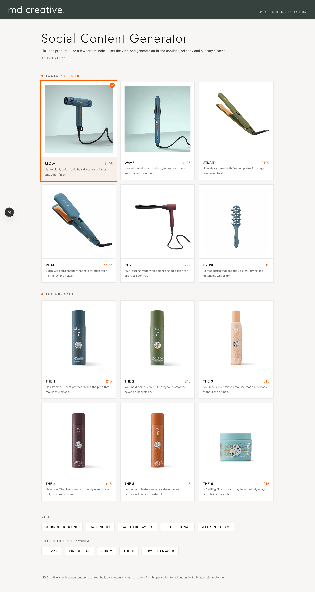
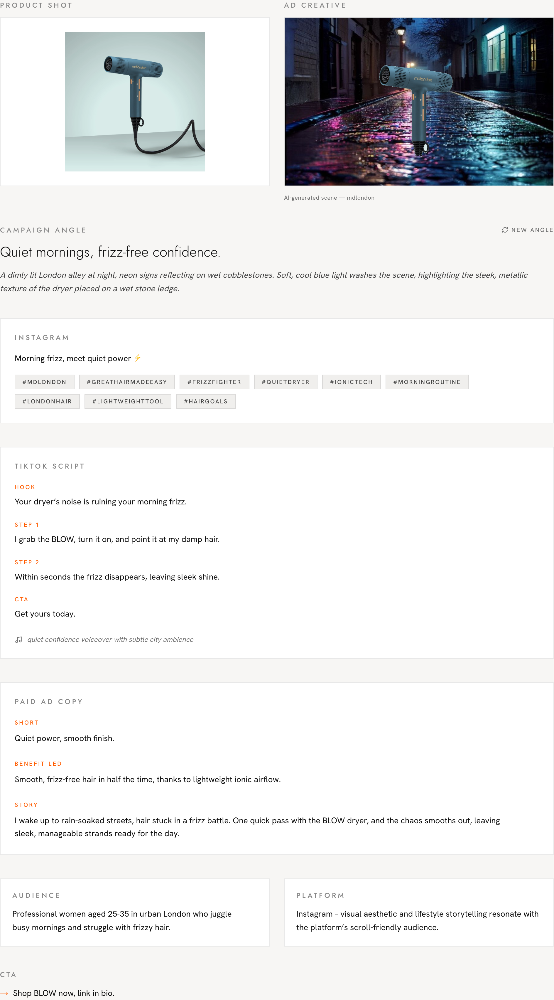
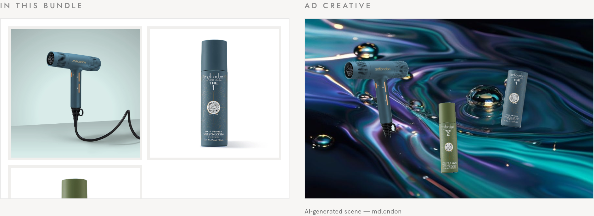
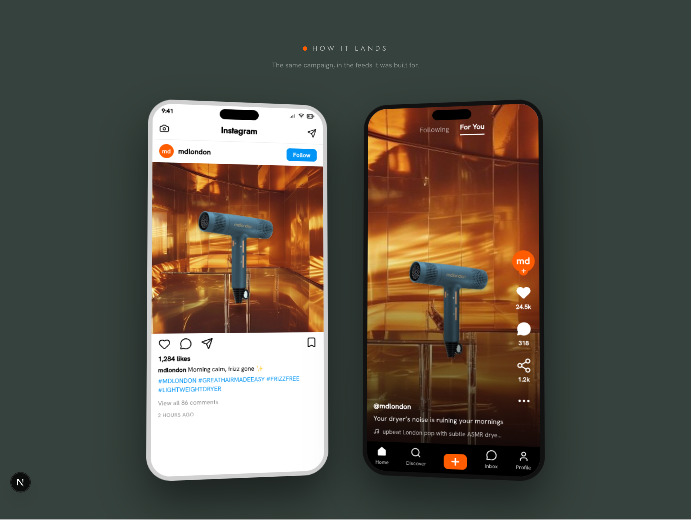

<div align="center">

# md creative.

**AI-powered social content generator for mdlondon**

*Built by [Kautum Krishnan](https://github.com/kautum) as part of a job application
for the Junior AI Developer role at [mdlondon](https://mdlondon.com)*


**[→ Live demo: md-creative.vercel.app](https://md-creative.vercel.app)**



</div>

---

## Why this, not a chatbot

mdlondon already has an AI chatbot — [The Knowing](https://mdlondon.com/pages/theknowing). Building
another one would have been a worse clone of something that already exists.

The job description asked for something specific: *"AI woven into paid content —
recreating our product range in AI-generated environments, right message to the right
person."* That is not a chatbot problem. It is a content-generation pipeline problem.

**md creative.** is what that brief asked for: pick a product, set the vibe and hair
concern, and get a complete campaign in one pass — copy in a few seconds, the lifestyle
scene moments behind it. It produces on-brand copy in every format their team actually
uses (Instagram caption, paid ad variants, TikTok script, campaign angle, creative
direction, audience brief), then composites the real product into an AI-generated scene.

---

## What it generates

For any single product or product bundle, one generation produces:

| Output | Description |
|--------|-------------|
| **Campaign angle** | The single idea a whole campaign could live on |
| **Creative direction** | Two sentences a photographer could shoot from |
| **Instagram caption** | ≤20 words, hook in the first four |
| **Hashtags** | 8–10 tags, always includes #MDLONDON and #GREATHAIRMADEEASY |
| **TikTok script** | Hook (3s) → step 1 → step 2 → CTA → audio vibe |
| **Paid ad copy** | Three real strategies: Short (≤6 words), Benefit-led, Story |
| **Audience** | One sentence: exactly who, and what moment in their life |
| **Platform recommendation** | One platform + why this product fits that format |
| **CTA** | ≤8 words, action-first |
| **AI lifestyle scene** | Generated by Pollinations.ai, informed by the campaign angle |
| **Product composite** | Real mdlondon product composited into the scene |
| **Platform previews** | Instagram post and TikTok frame mockups with live content |



---

## The product range

All 12 mdlondon products are built in with verified live CDN image URLs, real prices,
and taglines pulled from the actual product catalogue.

**Tools:** BLOW (£195), WAVE (£125), STRAIT (£109), PHAT (£129), CURL (£99), BRUSH (£13)

**The Numbers:** THE 1–6 (£15 each) — Hair Primer, Blow-Out Spray, Mousse, Hairspray,
Texture, Settling Finish

---

## Bundle mode

Select 2–12 products and the generation switches to a bundle campaign — one cohesive
concept that frames the products as a system, not a list.

The image compositing adapts to the selection size:

- **Tier 1 — single product:** hero shot, product cutout centred on the scene
- **Tier 2 — 2 to 4 products:** editorial flat-lay, real-scale proportional layout
- **Tier 3 — 5+ products:** the Ad Creative becomes a pure atmosphere scene with no
  product overlay — five or more cutouts on one scene reads as clutter, so instead every
  selected product appears cleanly in a "The Full Range" grid below the scene

This tiering is deliberate: the composite earns its place at one to four products, and
steps aside for a clean product grid when there are too many to stage well.



---

## Platform previews: "How It Lands"

After generation, the content appears inside realistic phone mockups — not a generic
frame, but a fully-populated Instagram post (profile, image, caption, hashtags, action
bar) and a TikTok screen (hook text, audio vibe, right-side icons, For You tab).

This answers the question a marketing team always has to imagine: *what will this
actually look like when it goes live?*



---

## Architecture and technical decisions

### The generation pipeline

Generation runs sequentially, not in parallel — a deliberate choice:

```text
1. Groq generates all copy fields, including scene_for_image_gen
   (a FLUX-ready scene description built from the campaign angle)
        ↓
2. scene_for_image_gen is passed to the image API as the prompt
   (so the scene is informed by the actual campaign concept, not generic)
        ↓
3. Browser loads the Pollinations URL asynchronously
   (no server-side timeout risk; skeleton UX covers the wait)
```

Run in parallel, the image would fall back to a generic, hardcoded per-vibe prompt.
Running it after the copy means the scene comes from the same creative brief as the
words — one campaign concept, not two unrelated ones.

### The scene variety problem

Without explicit constraints, the LLM collapsed to the same three scenes regardless of
vibe — bathroom, hotel room, or spa, the most common training-data association for
"lifestyle product photography."

The fix: a pool of 9 distinct visual style categories, each with an explicit
instruction that bans the literal-location defaults:

- **abstract-surreal** — flowing liquid colour, dreamlike gradients, editorial perfume-ad energy
- **architectural-minimal** — bold geometric shadows, raw concrete/stone, single-source light
- **nature-macro** — water droplets, silk fibres, botanical texture in golden light
- **studio-editorial** — bold seamless-paper backdrop, saturated colour, graphic shadow play
- **textural-closeup** — rippling fabric, marble veining or metallic surface in coloured light
- **color-field** — two-tone colour-blocked set, graphic and flat, strong directional shadow
- **urban-night** — moody London street, neon reflections on wet pavement, cinematic
- **botanical-greenhouse** — lush greenhouse, dappled light through leaves, jewel-toned plants
- **retro-chrome** — 70s-inspired chrome-and-glass set, warm amber tones, retro-futurist mood

Each generation picks one style at random. A banned-word check (`bathroom`, `hotel room`,
`spa`, `vanity`) runs on the generated scene description; if any appear, one targeted
retry fires with explicit negative constraints. This guarantees variety across
generations regardless of model tendency.

### The compositing problem

The original approach was `mix-blend-mode: multiply` — overlay the product image on top
of the scene with CSS. This works on light scenes but fails completely on dark or
saturated scenes, making products near-invisible.

The approach used in production:

1. **Background removal via border flood-fill.** The algorithm starts from the image
   border, flood-fills connected near-background pixels (neighbour tolerance = 8),
   and removes them. This handles both products on pure-white backgrounds *and* products
   on gradient backgrounds (like BLOW and WAVE, which ship on a blue-grey gradient).
   A naive brightness threshold failed on those cases.

2. **Fragment cleanup.** After removal, a connected-component pass discards any alpha
   "islands" smaller than 0.4% of the image that are not connected to the main product
   blob. This removes the disconnected cord/cable fragments that appeared in early tests
   without stripping genuine thin product details.

3. **Contact shadows.** Each product gets a synthetic shadow ellipse sized to its real
   physical footprint (estimated from height data), so heavier products cast
   proportionally stronger shadows and stop looking like floating cut-outs.

4. **Real-scale layout.** The original flat-lay used fixed-percentage widths, which made
   a £15 spray bottle render at nearly the same size as a £195 hair dryer. Each product
   now has an estimated real-world height (cm) in the data model; the flat-lay sizes
   products proportionally relative to the tallest selected product.

This cutout keeps the product's own studio lighting; it can't relight the product to
match the scene — the one trade-off this approach can't solve. See **Known limitations**
below for where that bites and how a production version would fix it.

### LLM selection

The text generation model is **`openai/gpt-oss-120b`** via Groq's free tier, chosen
after comparing the available free-tier Groq models head to head. It writes noticeably
less formulaic copy than Llama 3.3 70B — which matters for short-form marketing, where
generic phrasing is immediately visible to a reader.

Because gpt-oss-120b is a reasoning model, `reasoning_effort` is set to `"low"` and
`max_tokens` is raised to 4096 to prevent the reasoning chain from consuming the entire
token budget before completing the JSON output.

**Fallback chain:** on a 429 or 5xx from gpt-oss-120b, the route retries once after a
1.5s backoff, then falls back to `llama-3.3-70b-versatile` for that generation. The user
sees a subtle "running on backup model" note rather than a raw API error string.

### Brand voice system

The Groq system prompt embeds mdlondon's voice as a creative director persona with:
- Explicit NEVER/ALWAYS contrast examples
- Hard word limits per field (Short ≤6 words, caption ≤20 words, etc.)
- Banned phrases and copy patterns (no "Say goodbye to...", no "Revolutionary...")
- Field-specific rules for TikTok vs Instagram vs paid ad tone

The `tiktok_script.hook` field is specifically instructed to sound like a real creator
talking, not a brand script — because mdlondon's actual TikTok uses tutorial/demo
content, not polished ad voiceover.

---

## Tech stack

| Layer | Technology | Why |
|-------|-----------|-----|
| Framework | Next.js 16 App Router | File-based routing, server components, API routes in one repo |
| Language | TypeScript | Type safety across the generation pipeline and component tree |
| Styling | Tailwind v4 | CSS variables + utility classes; theme tokens in one place |
| LLM (text) | Groq + gpt-oss-120b | Free tier, fast inference, least formulaic copy of the free models tested |
| LLM (fallback) | Groq + Llama 3.3 70B | Higher TPM than primary; same provider, zero config change |
| Image generation | Pollinations.ai (flux) | Completely free, no API key, browser-loadable URL |
| Compositing | Browser canvas + flood-fill | Zero cost, no external API; cutout quality sufficient for Tier 1/2 |
| Animation | Framer Motion | Stagger, reveal, and typewriter effects |
| Fonts | Quicksand + Jost + Hanken Grotesk | Match mdlondon's rounded-sans wordmark; Jost for editorial nav |
| Hosting | Vercel | Free tier, auto-deploys from GitHub; the Groq call finishes well within the function timeout |

---

## Running locally

**Prerequisites:** Node.js 18+, a free Groq API key from [console.groq.com](https://console.groq.com)

```bash
git clone https://github.com/kautum/md-creative
cd md-creative
npm install
cp .env.example .env.local
# Add your GROQ_API_KEY to .env.local
npm run dev
```

Open `http://localhost:3000`. No other setup required — image generation uses
Pollinations.ai with no API key.

---

## Known limitations

**Lighting mismatch.** Products are cut out with their original studio lighting and
composited onto AI-generated scenes. On strongly coloured or warm-lit scenes, the product
reads as placed rather than naturally lit. Fixing this requires a relighting-capable
reference-image model (tested with Pollinations `kontext`, gated behind paid access at
time of build).

**Composite realism is strongest at one product.** A single hero composite is the
cleanest. The 2–4 flat-lays are strong for ideation but still read as a directional
concept, not a finished ad — mostly because of the lighting mismatch above. At 5+
products the overlay steps aside by design (see Bundle mode), so this is a one-to-four
consideration, not a degradation as the count climbs.

**Groq free-tier rate limits.** gpt-oss-120b has a low tokens-per-minute ceiling on the
free tier. Rapid back-to-back generations trigger the fallback chain, and sustained bursts
surface a friendly "running on backup model" or "busy, try again" message instead of a raw
error. A paid key removes the ceiling for heavy use.

**Image load latency.** Pollinations can take 10–25 seconds depending on load. The cycling
progress indicator covers the wait, but it is a real wait.

---

## What a production version would look like

This is a working prototype scoped to a job application. A production internal tool for
mdlondon's team would extend it with:

- **Proper AI compositing** — reference-image generation (kontext or equivalent) for
  lighting-coherent product placement
- **Approved-output memory** — save and learn from what the team actually posts
- **Brand-voice personalisation** — a short approved-posts corpus for few-shot examples
  that capture Michael Douglas's actual founder voice
- **Approval workflow** — a simple review/approve flow before anything downloads
- **Launch calendar integration** — tie generation to upcoming campaign dates

---

## About this project

Built by **Kautum Krishnan** — final-year MSc Data Science student at King's College
London, with a background in building production LLM automation systems at Celcom Solutions.

This tool was built specifically as a job application submission for the Junior AI
Developer / The AI One role at mdlondon, with a June 30, 2026 deadline.

GitHub: [kautum](https://github.com/kautum) · LinkedIn:
[kautum-krishnan](https://linkedin.com/in/kautum-krishnan-panjalaraja-4b81b4251)

---

<div align="center">

*md creative. is an independent concept tool built as part of a job application.
Not affiliated with or endorsed by mdlondon.*

</div>
