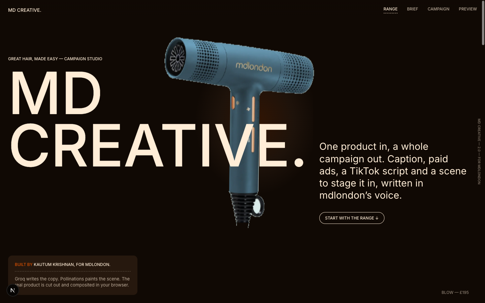
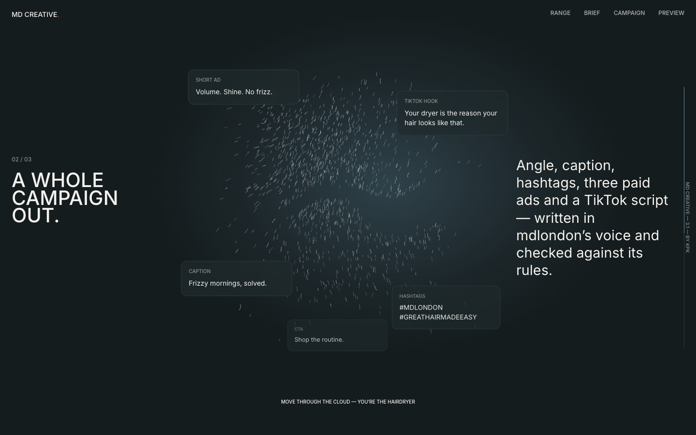
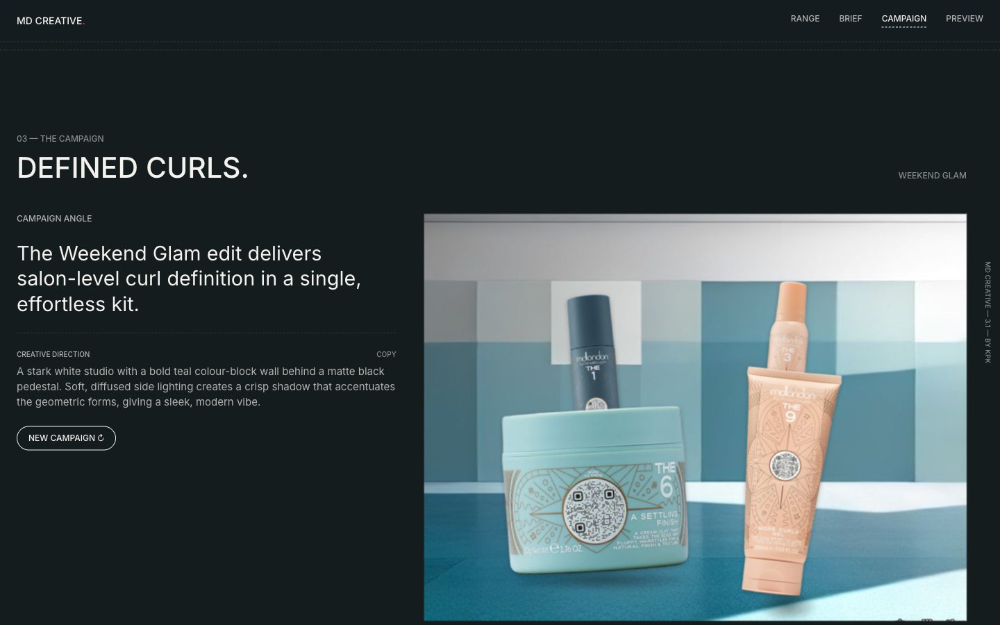
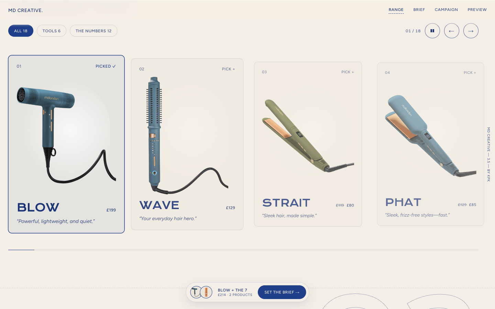
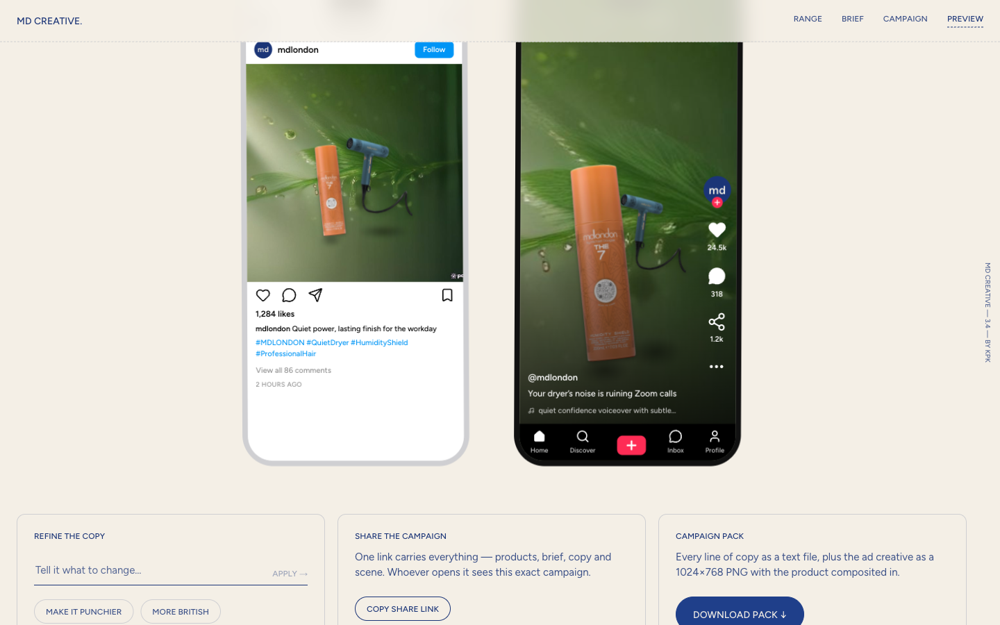

<div align="center">

# md creative.

**AI-powered social content generator for mdlondon**

*Built by [Kautum Krishnan Panjalaraja (KPK)](https://github.com/kautum) as part of a job application
for the Junior AI Developer role at [mdlondon](https://mdlondon.com)*


**[→ Live demo: md-creative.vercel.app](https://md-creative.vercel.app)**



</div>

---

## What's new in 3.1

The final 5%: everything in 3.1 came from researching mdlondon itself. The sources
were the live store's catalogue (`products.json`), its theme colours and its own
bundles.

**The real catalogue.** The Numbers 7–12 (Humidity Shield, Dry Heat Protection,
More Curls Gel, Pre & Post Oil, Dry Cleaning, Salt Mousse) launched after 1.0 and
were missing. Five of the six tool prices had drifted, and STRAIT and PHAT are on
sale. Prices are now read **live from mdlondon.com** and cached for an hour. If the
store can't be reached, the page says "Prices as of 9 Oct 2026" instead of
presenting stale prices as current. `npm test` checks the catalogue against the
store's own bundle maths: every bundle's "was" price must equal the sum of its
products.

**mdlondon's own routines.** One tap selects a real bundle, such as Volume + Body,
Defined Curls or ALL 12. The capsule and brief quote the bundle price and saving,
and the copy's CTA names it ("Shop the Defined Curls bundle — £50").

**A palette that belongs to the brand.** Ink `#151C1E` (mdlondon's primary) is the
canvas, slate `#415257` the structure, and coral `#F35046` the brand mark, the
full stop in **MD CREATIVE.** Each product's own body colour, sampled from its
cutout, becomes the page's live `--tone`: select THE 5 and the light turns burnt
orange, select CURL and it turns Berry.

**Particles with a point of view.** Tools assemble from **hair strands**, combed
by a drifting airflow. The Numbers condense from **mist**, like a spray. In the
hero's middle chapter the product dissolves into a cloud, and **your cursor is
the hairdryer**: move through it and the strands part.

**The Knowing.** Every Numbers bottle carries a "Scan to Know" QR code that opens
Michael Douglas's AI on WhatsApp. The copy model now knows this and can use it,
once, as a hook.

**Fixes:** a selected chip went white-on-white on hover; the brand check counted
"—" as a word; BLOW and WAVE linked to redirecting product URLs. Share links now
unfurl with a real preview image, and the default Next favicon is replaced by an
`md.` mark.

## What's new in 3.0



**An experience, not a form.** 3.0 borrows its motion vocabulary from the four
reference design systems in `designs/`. The base is the warm-dark darkroom system.
On top of it sit Dala's particle constellation, Apple's pinned scroll storytelling
and floating price capsule, and Mercury's frosted nav.

- **Pinned hero story.** The product assembles from a constellation of particles
  sampled from its own pixels. Scrolling then carries it through three chapters: one
  product in; a whole campaign out, where it dissolves and real copy bursts from it;
  and staged on a plinth. Scroll is spring-smoothed, and the product tilts toward
  the mouse.
- **The range as a gallery.** On desktop the section pins and vertical scroll
  drives the product track sideways. On touch it's a swipe carousel with snap
  points.
- **Selection capsule.** Once you pick something, a floating pill follows you with
  thumbnails, the running £ total and a one-tap Generate.
- **Campaign reveal.** While the scene paints, the lead product breathes as a
  constellation. The finished scene then wipes in with scroll parallax, and the
  phone mockups swing in from either side as you scroll.

**Product images, rebuilt.** The in-browser flood-fill cutout (700px, hard edges,
bleeding into low-contrast products) is replaced by `scripts/make_cutouts.py`. It
runs BiRefNet segmentation on the 2048px source images, decontaminates the colour
of semi-transparent edge pixels so nothing haloes on the dark canvas, and ships
tight-cropped WebPs. All 12 total 984KB.

**New features**
- **Share link.** The whole campaign is deflated into the URL fragment (about 2KB),
  with no backend and no account. Every field is re-validated when the link is
  opened, and a damaged link is rejected with a message.
- **Brand check.** Each campaign is scored against the brand voice's hard rules:
  ≤6-word short ad, ≤20-word caption, 8–10 hashtags including #MDLONDON, no banned
  words, and more. `npm test` runs it against the brand guide's own good and bad
  examples.
- **Smart brief.** The vibes and hair concerns your selection is made for are
  marked ✦. That product data existed in 1.0 and 2.0 but was never shown.
- **⌘/Ctrl + Enter** generates from anywhere on the page.

**Fixed:** scenes could contain people. The old "beauty lifestyle photography"
prompt made the free-tier model paint a model, including a sexualised figure in
testing. Scenes are now framed as empty sets, with a negative prompt and
Pollinations' safety filter on.

## What's new in 2.0

- **Darkroom redesign.** The interface now follows a warm-dark product-editorial
  system: walnut canvas, cream uppercase type, one filled button per section,
  hairline dashed dividers, no shadows. Every product is shown as a
  background-removed cutout floating in the dark, so there are no white boxes.
- **Four-section flow.** Range → Brief → Campaign → Preview, with a fixed
  scroll-spy nav. Generating scrolls you straight to the result.
- **Fallback model fixed.** Groq retired `llama-3.3-70b-versatile`, so every
  rate-limited generation in 1.0 failed instead of falling back. It now falls back
  to `openai/gpt-oss-20b`.
- **Brand voice is enforced, not just suggested.** The banned-phrase list is sent
  to the model, and output that uses one is regenerated once.
- **Inputs are validated at the API.** Unknown products, vibes or hair concerns
  are rejected with a 400 instead of being interpolated into the prompt.
- **Copy and image stay in sync.** "New campaign" regenerates both. Refining keeps
  the original scene, and refined copy is saved back to the campaign history.
- **Scene loading survives the Pollinations rate limit** (see Known limitations).
  Retries wait out the limit instead of failing within a second, and the phone
  previews use whichever scene actually loaded.

---

## Why this, not a chatbot

mdlondon already has an AI chatbot — [The Knowing](https://mdlondon.com/pages/theknowing). Building
another one would have been a worse clone of something that already exists.

The job description asked for something specific: *"AI woven into paid content —
recreating our product range in AI-generated environments, right message to the right
person."* That is not a chatbot problem. It is a content-generation pipeline problem.

**md creative.** is what that brief asked for: pick a product, set the vibe and hair
concern, and get a complete campaign in one pass — copy in a few seconds, the lifestyle
scene moments behind it. It produces on-brand copy in every format their team actually
uses (Instagram caption, paid ad variants, TikTok script, campaign angle, creative
direction, audience brief), then composites the real product into an AI-generated scene.

---

## What it generates

For any single product or product bundle, one generation produces:

| Output | Description |
|--------|-------------|
| **Campaign angle** | The single idea a whole campaign could live on |
| **Creative direction** | Two sentences a photographer could shoot from |
| **Instagram caption** | ≤20 words, hook in the first four |
| **Hashtags** | 8–10 tags, always includes #MDLONDON and #GREATHAIRMADEEASY |
| **TikTok script** | Hook (3s) → step 1 → step 2 → CTA → audio vibe |
| **Paid ad copy** | Three real strategies: Short (≤6 words), Benefit-led, Story |
| **Audience** | One sentence: exactly who, and what moment in their life |
| **Platform recommendation** | One platform + why this product fits that format |
| **CTA** | ≤8 words, action-first |
| **AI lifestyle scene** | Generated by Pollinations.ai, informed by the campaign angle |
| **Product composite** | Real mdlondon product composited into the scene |
| **Platform previews** | Instagram post and TikTok frame mockups with live content |



---

## The product range

All 18 mdlondon products are built in with verified live CDN image URLs, live prices,
and taglines pulled from the actual product catalogue.

**Tools:** BLOW (£199), WAVE (£129), STRAIT (£80, was £119), PHAT (£85, was £129), CURL (£129), BRUSH (£13). Prices as of 9 Oct 2026; the app reads them live.

**The Numbers:** THE 1–12 (£15 each) — Hair Primer, Blow-Out Spray, Mousse, Hairspray,
Texture, Settling Finish, Humidity Shield, Dry Heat Protection, More Curls Gel,
Pre & Post Oil, Dry Cleaning, Salt Mousse

---

## Bundle mode

Select 2–12 products and the generation switches to a bundle campaign — one cohesive
concept that frames the products as a system, not a list.

The image compositing adapts to the selection size:

- **Tier 1 — single product:** hero shot, product cutout centred on the scene
- **Tier 2 — 2 to 4 products:** editorial flat-lay, real-scale proportional layout
- **Tier 3 — 5+ products:** the Ad Creative becomes a pure atmosphere scene with no
  product overlay — five or more cutouts on one scene reads as clutter, so instead every
  selected product appears cleanly in a "The Full Range" grid below the scene

This tiering is deliberate: the composite earns its place at one to four products, and
steps aside for a clean product grid when there are too many to stage well.



---

## Platform previews: "How It Lands"

After generation, the content appears inside realistic phone mockups — not a generic
frame, but a fully-populated Instagram post (profile, image, caption, hashtags, action
bar) and a TikTok screen (hook text, audio vibe, right-side icons, For You tab).

This answers the question a marketing team always has to imagine: *what will this
actually look like when it goes live?*



---

## Architecture and technical decisions

### The generation pipeline

Generation runs sequentially, not in parallel — a deliberate choice:

```text
1. Groq generates all copy fields, including scene_for_image_gen
   (a FLUX-ready scene description built from the campaign angle)
        ↓
2. scene_for_image_gen is passed to the image API as the prompt
   (so the scene is informed by the actual campaign concept, not generic)
        ↓
3. Browser loads the Pollinations URL asynchronously
   (no server-side timeout risk; skeleton UX covers the wait)
```

Run in parallel, the image would fall back to a generic, hardcoded per-vibe prompt.
Running it after the copy means the scene comes from the same creative brief as the
words — one campaign concept, not two unrelated ones.

### The scene variety problem

Without explicit constraints, the LLM collapsed to the same three scenes regardless of
vibe — bathroom, hotel room, or spa, the most common training-data association for
"lifestyle product photography."

The fix: a pool of 9 distinct visual style categories, each with an explicit
instruction that bans the literal-location defaults:

- **abstract-surreal** — flowing liquid colour, dreamlike gradients, editorial perfume-ad energy
- **architectural-minimal** — bold geometric shadows, raw concrete/stone, single-source light
- **nature-macro** — water droplets, silk fibres, botanical texture in golden light
- **studio-editorial** — bold seamless-paper backdrop, saturated colour, graphic shadow play
- **textural-closeup** — rippling fabric, marble veining or metallic surface in coloured light
- **color-field** — two-tone colour-blocked set, graphic and flat, strong directional shadow
- **urban-night** — moody London street, neon reflections on wet pavement, cinematic
- **botanical-greenhouse** — lush greenhouse, dappled light through leaves, jewel-toned plants
- **retro-chrome** — 70s-inspired chrome-and-glass set, warm amber tones, retro-futurist mood

Each generation picks one style at random. A banned-word check (`bathroom`, `hotel room`,
`spa`, `vanity`) runs on the generated scene description; if any appear, one targeted
retry fires with explicit negative constraints. This guarantees variety across
generations regardless of model tendency.

### The compositing problem

The original approach was `mix-blend-mode: multiply` — overlay the product image on top
of the scene with CSS. This works on light scenes but fails completely on dark or
saturated scenes, making products near-invisible.

The approach used in production:

> **3.0:** steps 1–2 below described the original browser flood-fill. Cutouts are
> now generated offline with an AI segmentation model (see *What's new in 3.0*); the
> real-scale layout and contact shadows are unchanged.

1. **Background removal via border flood-fill.** The algorithm starts from the image
   border, flood-fills connected near-background pixels (neighbour tolerance = 8),
   and removes them. This handles both products on pure-white backgrounds *and* products
   on gradient backgrounds (like BLOW and WAVE, which ship on a blue-grey gradient).
   A naive brightness threshold failed on those cases.

2. **Fragment cleanup.** After removal, a connected-component pass discards any alpha
   "islands" smaller than 0.4% of the image that are not connected to the main product
   blob. This removes the disconnected cord/cable fragments that appeared in early tests
   without stripping genuine thin product details.

3. **Contact shadows.** Each product gets a synthetic shadow ellipse sized to its real
   physical footprint (estimated from height data), so heavier products cast
   proportionally stronger shadows and stop looking like floating cut-outs.

4. **Real-scale layout.** The original flat-lay used fixed-percentage widths, which made
   a £15 spray bottle render at nearly the same size as a £195 hair dryer. Each product
   now has an estimated real-world height (cm) in the data model; the flat-lay sizes
   products proportionally relative to the tallest selected product.

This cutout keeps the product's own studio lighting; it can't relight the product to
match the scene — the one trade-off this approach can't solve. See **Known limitations**
below for where that bites and how a production version would fix it.

### LLM selection

The text generation model is **`openai/gpt-oss-120b`** via Groq's free tier, chosen
after comparing the available free-tier Groq models head to head. It writes noticeably
less formulaic copy than the other models on the account — which matters for short-form marketing, where
generic phrasing is immediately visible to a reader.

Because gpt-oss-120b is a reasoning model, `reasoning_effort` is set to `"low"` and
`max_tokens` is raised to 4096 to prevent the reasoning chain from consuming the entire
token budget before completing the JSON output.

**Fallback chain:** on a 429 or 5xx from gpt-oss-120b, the route retries once after a
1.5s backoff, then falls back to `openai/gpt-oss-20b` for that generation. The user
sees a subtle "running on backup model" note rather than a raw API error string.

### Brand voice system

The Groq system prompt embeds mdlondon's voice as a creative director persona with:
- Explicit NEVER/ALWAYS contrast examples
- Hard word limits per field (Short ≤6 words, caption ≤20 words, etc.)
- Banned phrases and copy patterns (no "Say goodbye to...", no "Revolutionary...")
- Field-specific rules for TikTok vs Instagram vs paid ad tone

The `tiktok_script.hook` field is specifically instructed to sound like a real creator
talking, not a brand script — because mdlondon's actual TikTok uses tutorial/demo
content, not polished ad voiceover.

---

## Tech stack

| Layer | Technology | Why |
|-------|-----------|-----|
| Framework | Next.js 16 App Router | File-based routing, server components, API routes in one repo |
| Language | TypeScript | Type safety across the generation pipeline and component tree |
| Styling | Tailwind v4 | CSS variables + utility classes; theme tokens in one place |
| LLM (text) | Groq + gpt-oss-120b | Free tier, fast inference, least formulaic copy of the free models tested |
| LLM (fallback) | Groq + gpt-oss-20b | Same model family and params, more rate-limit headroom |
| Image generation | Pollinations.ai (flux) | Completely free, no API key, browser-loadable URL |
| Cutouts | BiRefNet via rembg, offline | Soft alpha matte from 2048px sources, colour-decontaminated edges; static WebPs |
| Motion | Framer Motion + canvas | Scroll-scrubbed stages, particle constellation, spring smoothing; all respect reduced motion |
| Fonts | Inter (ss01) | Free stand-in for Halyard Display, the face the design system was measured on |
| Hosting | Vercel | Free tier, auto-deploys from GitHub; the Groq call finishes well within the function timeout |

---

## Running locally

**Prerequisites:** Node.js 18+, a free Groq API key from [console.groq.com](https://console.groq.com)

```bash
git clone https://github.com/kautum/md-creative
cd md-creative
npm install
cp .env.example .env.local
# Add your GROQ_API_KEY to .env.local
npm run dev
```

Open `http://localhost:3000`. No other setup required — image generation uses
Pollinations.ai with no API key.

---

## Known limitations

**Lighting mismatch.** Products are cut out with their original studio lighting and
composited onto AI-generated scenes. On strongly coloured or warm-lit scenes, the product
reads as placed rather than naturally lit. Fixing this requires a relighting-capable
reference-image model (tested with Pollinations `kontext`, gated behind paid access at
time of build).

**Composite realism is strongest at one product.** A single hero composite is the
cleanest. The 2–4 flat-lays are strong for ideation but still read as a directional
concept, not a finished ad — mostly because of the lighting mismatch above. At 5+
products the overlay steps aside by design (see Bundle mode), so this is a one-to-four
consideration, not a degradation as the count climbs.

**Groq free-tier rate limits.** gpt-oss-120b has a low tokens-per-minute ceiling on the
free tier. Rapid back-to-back generations trigger the fallback chain, and sustained bursts
surface a friendly "running on backup model" or "busy, try again" message instead of a raw
error. A paid key removes the ceiling for heavy use.

**Pollinations free tier.** Without an API key, Pollinations allows roughly one
image per minute per visitor and answers HTTP 402 inside that window. It also serves
`sana` rather than the requested `flux`, and stamps a small watermark despite
`nologo=true` (all measured October 2026). The scene card retries at 20s and 45s and
says so. A key from enter.pollinations.ai lifts all three limits, but it would have to
go through a server-side proxy, because the browser loads the image directly.

**Image load latency.** Pollinations can take 5–25 seconds depending on load. The cycling
progress indicator covers the wait, but it is a real wait.

---

## What a production version would look like

This is a working prototype scoped to a job application. A production internal tool for
mdlondon's team would extend it with:

- **Proper AI compositing** — reference-image generation (kontext or equivalent) for
  lighting-coherent product placement
- **Approved-output memory** — save and learn from what the team actually posts
- **Brand-voice personalisation** — a short approved-posts corpus for few-shot examples
  that capture Michael Douglas's actual founder voice
- **Approval workflow** — a simple review/approve flow before anything downloads
- **Launch calendar integration** — tie generation to upcoming campaign dates

---

## About this project

Built by **Kautum Krishnan Panjalaraja (KPK)** — final-year MSc Data Science student at King's College
London, with a background in building production LLM automation systems at Celcom Solutions.

This tool was built specifically as a job application submission for the Junior AI
Developer / The AI One role at mdlondon, with a June 30, 2026 deadline.

GitHub: [kautum](https://github.com/kautum) · LinkedIn:
[kautum-krishnan](https://linkedin.com/in/kautum-krishnan-panjalaraja-4b81b4251)

---

<div align="center">

*md creative. is an independent concept tool built as part of a job application.
Not affiliated with or endorsed by mdlondon.*

</div>
